<div align="center">
  
  <h1>Kops</h1>
  <span>English | <a href="./README.zh-CN.md">中文</a></span>
</div>

# Kops Introduction

Kops is a Kubernetes resource management platform that is suitable for learning web development technologies such as Vue.js and Go. We are looking for like-minded individuals to join us in the development of Kops and expand its services to a wider community of cloud-native enthusiasts. Together, let's make Kops an even more powerful tool for managing Kubernetes!

## Document

- Documentation: [link](https://docs.cillian.website)

## Online preview

- coding 


## Recommended IDE Setup

[VSCode](https://code.visualstudio.com/) + [Volar](https://marketplace.visualstudio.com/items?itemName=Vue.volar) (and disable Vetur) + [TypeScript Vue Plugin (Volar)](https://marketplace.visualstudio.com/items?itemName=Vue.vscode-typescript-vue-plugin).

## Type Support for `.vue` Imports in TS

TypeScript cannot handle type information for `.vue` imports by default, so we replace the `tsc` CLI with `vue-tsc` for type checking. In editors, we need [TypeScript Vue Plugin (Volar)](https://marketplace.visualstudio.com/items?itemName=Vue.vscode-typescript-vue-plugin) to make the TypeScript language service aware of `.vue` types.

If the standalone TypeScript plugin doesn't feel fast enough to you, Volar has also implemented a [Take Over Mode](https://github.com/johnsoncodehk/volar/discussions/471#discussioncomment-1361669) that is more performant. You can enable it by the following steps:

1. Disable the built-in TypeScript Extension
    1) Run `Extensions: Show Built-in Extensions` from VSCode's command palette
    2) Find `TypeScript and JavaScript Language Features`, right click and select `Disable (Workspace)`
2. Reload the VSCode window by running `Developer: Reload Window` from the command palette.

## Customize configuration

See [Vite Configuration Reference](https://vitejs.dev/config/).

## Project Setup

```sh
pnpm install
```

### Compile and Hot-Reload for Development

```sh
pnpm dev
```

### Type-Check, Compile and Minify for Production

```sh
pnpm build
```

### Run Unit Tests with [Vitest](https://vitest.dev/)

```sh
pnpm test:unit
```

### Lint with [ESLint](https://eslint.org/)

```sh
pnpm lint
```

## Feature Showcase Page

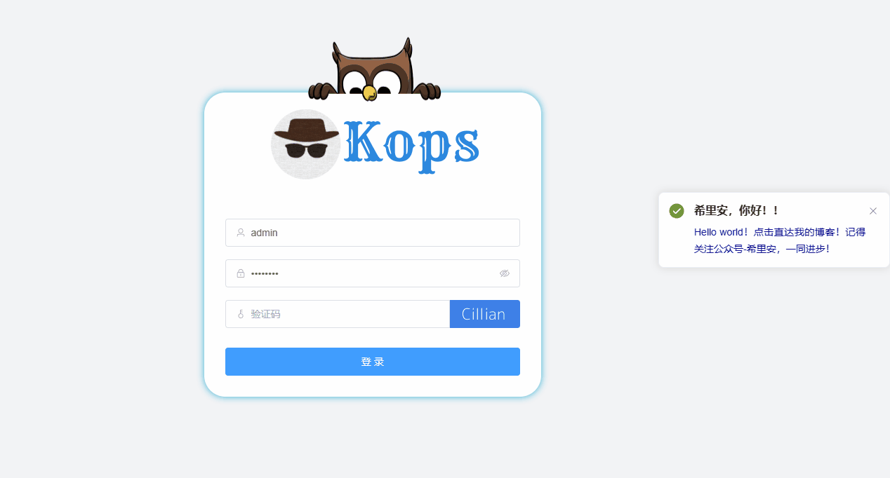

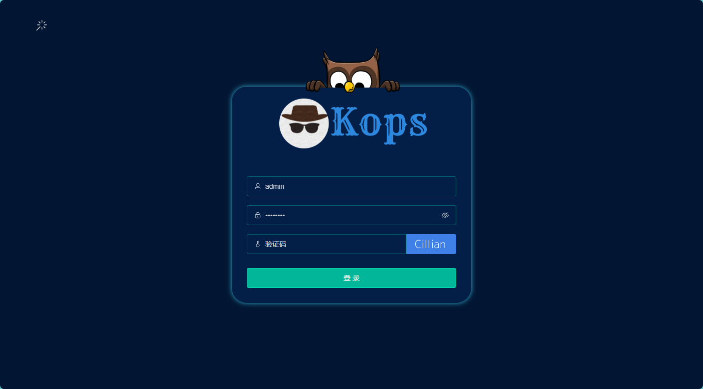

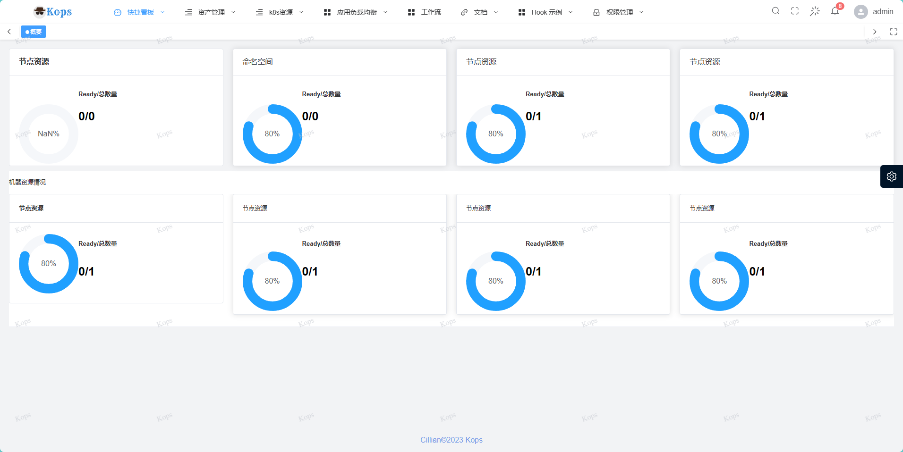

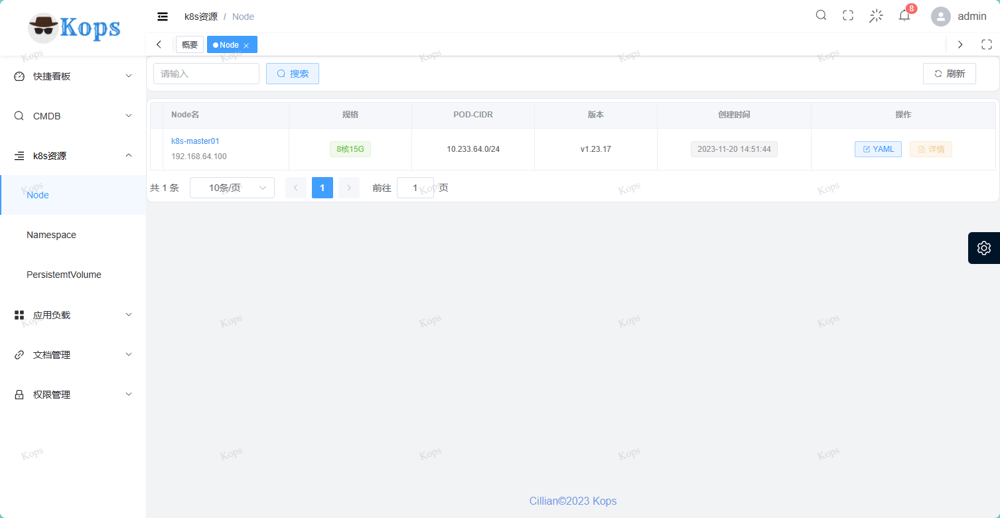

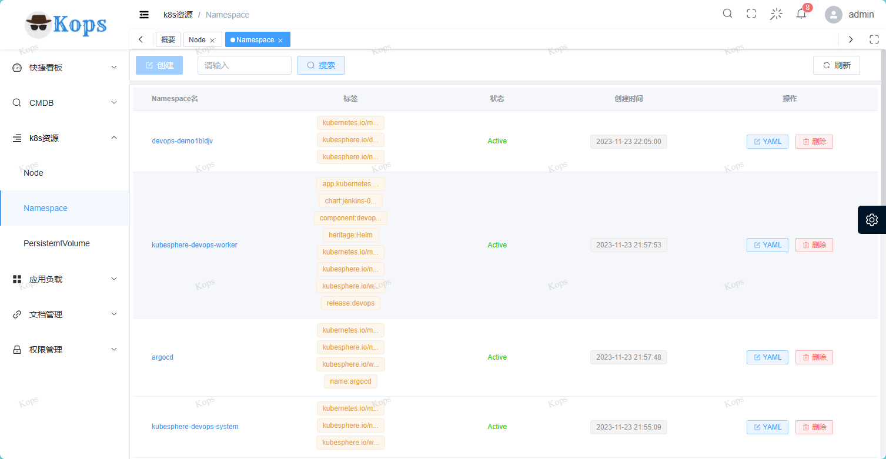

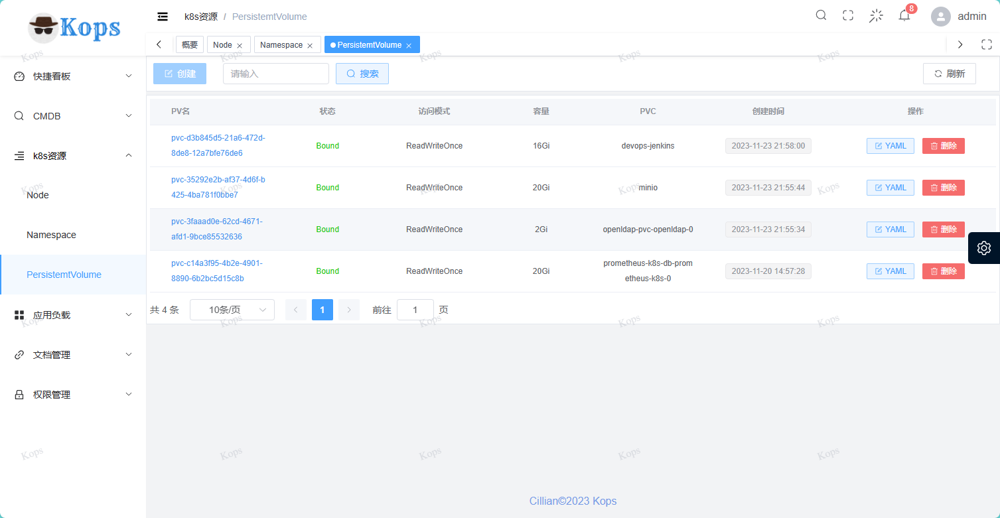

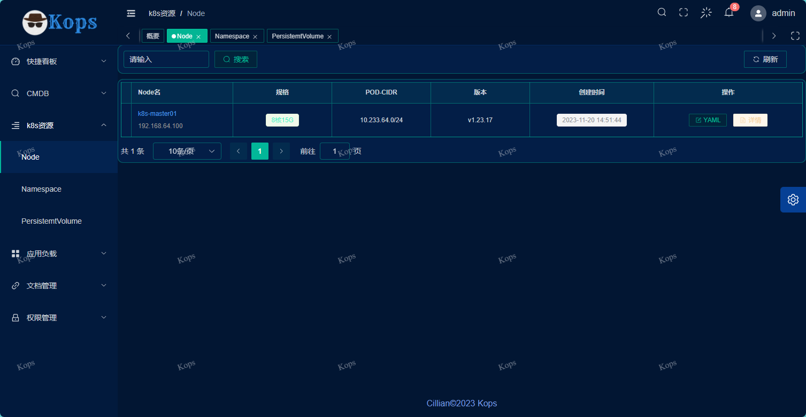

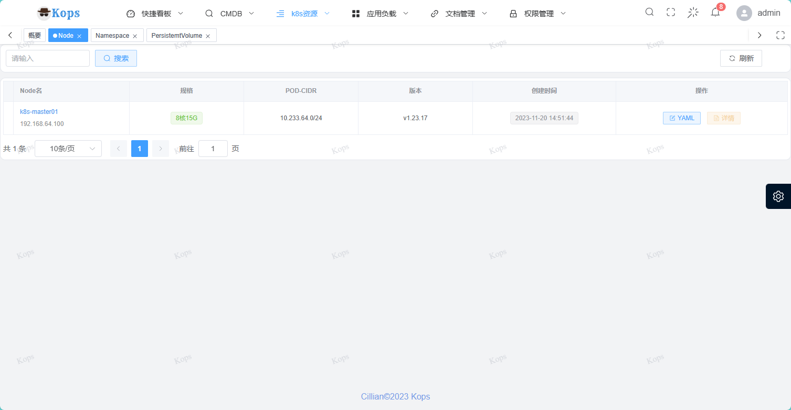

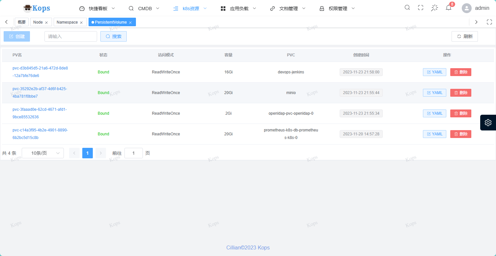

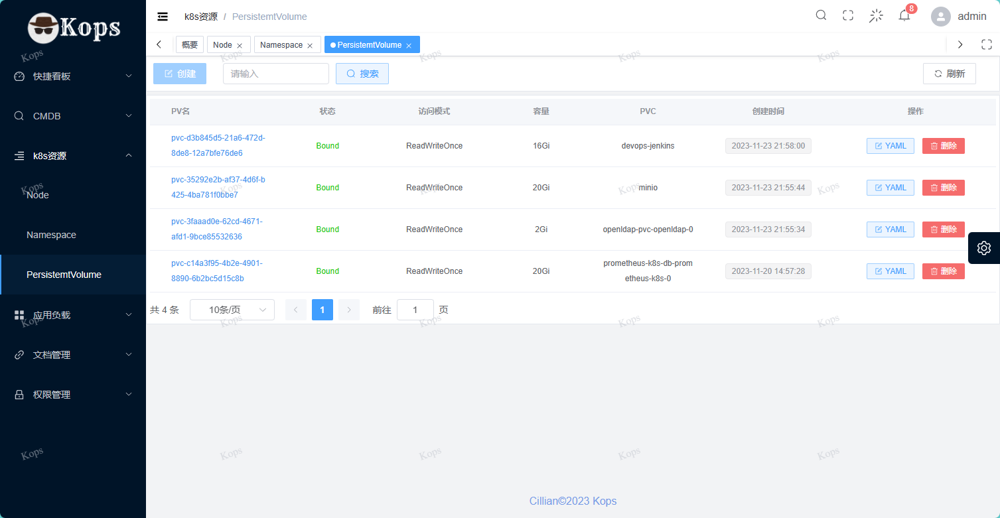

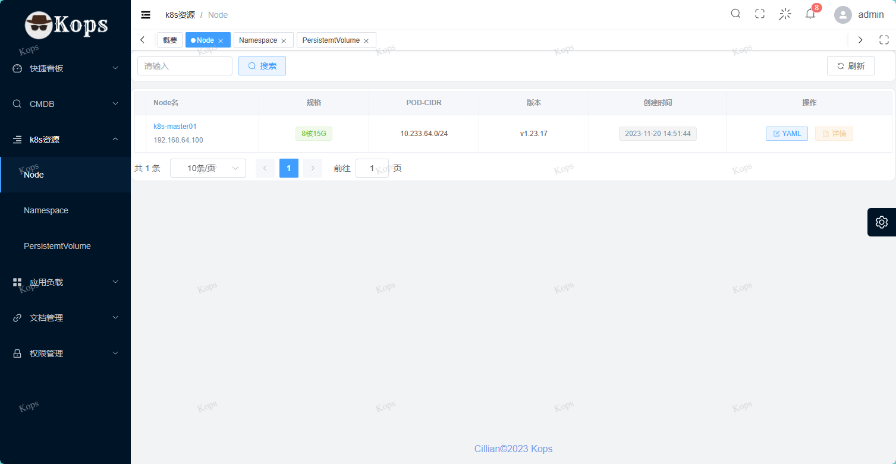

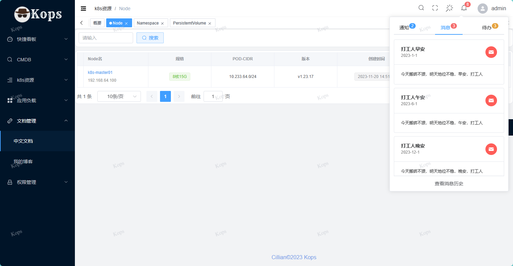


## Git commit specification reference

- `feat` add new functions
- `fix` Fix issues/bugs
- `perf` Optimize performance
- `style` Change the code style without affecting the running result
- `refactor` Re-factor code
- `revert` Undo changes
- `test` Test related, does not involve changes to business code
- `docs` Documentation and Annotation
- `chore` Updating dependencies/modifying scaffolding configuration, etc.
- `workflow` Work flow Improvements
- `ci` CICD
- `types` Type definition
- `wip` In development


## Thanks 

Gaining recognition for small projects can be challenging. If you find value in this project, please consider showing your support with a star. Your encouragement is the key motivation for the author to maintain the project regularly. And just a little reminder: it's completely free to give a star!

## Contact Information

- Email: cilliandevops@gmail.com

- Website: https://www.cillian.website

- WeChat：cilliandevops


## License

[MIT License](./LICENSE)

Copyright (c) 2023-present [cilliandevops](https://github.com/cilliandevops)


